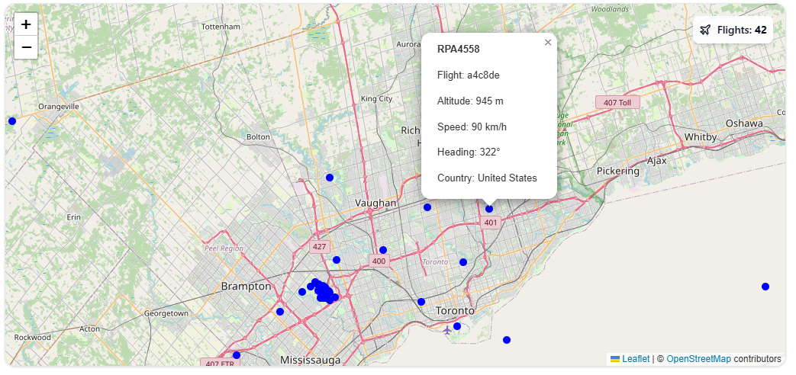

<!-- PROJECT LOGO -->
<br />
<div align="center">
  <a href="https://github.com/ayh-a/flight-tracker-dashboard.git">
    
  </a>

  <h3 align="center">AirWatch</h3>

  <p align="center">
    <i>AirWatch is an aviation monitoring system that aggregates real-time flight and weather data</i>
    <br />
    <!-- <a href="https://github.com/othneildrew/Best-README-Template"><strong>Explore the docs »</strong></a> -->
    <br /> 
    <!-- <br /> -->
    <!-- <a href="https://github.com/othneildrew/Best-README-Template">View Demo</a>
    &middot;
    <a href="https://github.com/othneildrew/Best-README-Template/issues/new?labels=bug&template=bug-report---.md">Report Bug</a>
    &middot; -->
    <a href="https://github.com/ayh-a/flight-tracker-dashboard/issues/new?labels=enhancement&template=feature-request---.md">Request Feature</a>
  </p>
</div>


<!-- TABLE OF CONTENTS -->
<details>
  <summary>Table of Contents</summary>
  <ol>
    <li>
      <a href="#introduction">About The Project</a>
    </li>
    <li>
      <a href="#getting-started">Getting Started</a>
      <ul>
        <li><a href="#prerequisites">Prerequisites</a></li>
        <li><a href="#installation">Installation</a></li>
      </ul>
    </li>
    <!-- <li><a href="#usage">Usage</a></li> -->
    <li><a href="#roadmap">Roadmap</a></li>
    <li><a href="#contributing">Contributing</a></li>
    <!-- <li><a href="#license">License</a></li> -->
    <!-- <li><a href="#contact">Contact</a></li> -->
    <li><a href="#acknowledgments">Acknowledgments</a></li>
  </ol>
</details>


<!-- ABOUT THE PROJECT -->
## Introduction

**AirWatch** is a real-time flight tracking and weather monitoring dashboard. It aggregates aircraft data from OpenSky API and weather insights from WeatherAPI, offering an interactive and data-rich aviation monitoring experience.

- Built with **Spring Boot**, **React**, and **Docker**

<p align="center"></p>
<p align="center"><i>Interactive map with flight markers</i></p>


<!-- GETTING STARTED -->
## Getting Started

To run airWatch locally, simply clone the repository and spin up the Docker containers.
### Prerequisites

Before running airWatch, ensure you have:

- [Docker](https://docs.docker.com/get-docker/) installed

### Installation

Before spinning up a docker container, you will need to:
1. Create an account at [Opensky Network](https://opensky-network.org/)
2. Create an account and get an API Key at [Weatherbit](https://www.weatherbit.io/)

3. Clone the repo
   ```sh
   git clone https://github.com/ayh-a/flight-tracker-dashboard.git
   ```
4. Create a **.env** file at the root of the project, then open it in a text editor and enter the following:
   ```sh
    WEATHER_API_KEY=[your api key from weatherbit]
    API_USERNAME=[opensky username]
    API_PASSWORD=[opensky password]
   ```

   Now you should be ready to create the Docker container
   <br><br>

5. Run this command at the root of the project:
   ```sh
   docker-compose up --build
   ```


<!-- USAGE EXAMPLES -->
<!-- ## Usage

Use this space to show useful examples of how a project can be used. Additional screenshots, code examples and demos work well in this space. You may also link to more resources.

_For more examples, please refer to the [Documentation](https://example.com)_

<p align="right">(<a href="#readme-top">back to top</a>)</p> -->


<!-- ROADMAP -->
## Roadmap

- [x] Interactive map with live data
- [x] Dashboard components
- [ ] Redis cache
- [ ] Search bar for location

<!-- See the [open issues](https://github.com/othneildrew/Best-README-Template/issues) for a full list of proposed features (and known issues). -->


<!-- CONTRIBUTING -->
## Contributing

Any contributions are welcome and **greatly appreciated**.

If you have any suggestions that you think would make this better, please fork the repo and create a pull request. You can also open an issue.
Don't forget to give the project a star!

<!-- 1. Fork the Project
2. Create your Feature Branch (`git checkout -b feature/AmazingFeature`)
3. Commit your Changes (`git commit -m 'Add some AmazingFeature'`)
4. Push to the Branch (`git push origin feature/AmazingFeature`)
5. Open a Pull Request -->


<!-- LICENSE -->
<!-- ## License

Distributed under the Unlicense License. See `LICENSE.txt` for more information.

<p align="right">(<a href="#readme-top">back to top</a>)</p> -->


<!-- CONTACT -->
<!-- ## Contact

Your Name - [@your_twitter](https://twitter.com/your_username) - email@example.com

Project Link: [https://github.com/your_username/repo_name](https://github.com/your_username/repo_name)

<p align="right">(<a href="#readme-top">back to top</a>)</p> -->


<!-- ACKNOWLEDGMENTS -->
## Acknowledgments

* [shadcn](https://ui.shadcn.com/)


<!-- MARKDOWN LINKS & IMAGES -->
<!-- https://www.markdownguide.org/basic-syntax/#reference-style-links -->
[contributors-shield]: https://img.shields.io/github/contributors/othneildrew/Best-README-Template.svg?style=for-the-badge
[contributors-url]: https://github.com/othneildrew/Best-README-Template/graphs/contributors
[forks-shield]: https://img.shields.io/github/forks/othneildrew/Best-README-Template.svg?style=for-the-badge
[forks-url]: https://github.com/othneildrew/Best-README-Template/network/members
[stars-shield]: https://img.shields.io/github/stars/othneildrew/Best-README-Template.svg?style=for-the-badge
[stars-url]: https://github.com/othneildrew/Best-README-Template/stargazers
[issues-shield]: https://img.shields.io/github/issues/othneildrew/Best-README-Template.svg?style=for-the-badge
[issues-url]: https://github.com/othneildrew/Best-README-Template/issues
[license-shield]: https://img.shields.io/github/license/othneildrew/Best-README-Template.svg?style=for-the-badge
[license-url]: https://github.com/othneildrew/Best-README-Template/blob/master/LICENSE.txt
[linkedin-shield]: https://img.shields.io/badge/-LinkedIn-black.svg?style=for-the-badge&logo=linkedin&colorB=555
[linkedin-url]: https://linkedin.com/in/othneildrew
[product-screenshot]: images/screenshot.png
[Next.js]: https://img.shields.io/badge/next.js-000000?style=for-the-badge&logo=nextdotjs&logoColor=white
[Next-url]: https://nextjs.org/
[React.js]: https://img.shields.io/badge/React-20232A?style=for-the-badge&logo=react&logoColor=61DAFB
[React-url]: https://reactjs.org/
[Vue.js]: https://img.shields.io/badge/Vue.js-35495E?style=for-the-badge&logo=vuedotjs&logoColor=4FC08D
[Vue-url]: https://vuejs.org/
[Angular.io]: https://img.shields.io/badge/Angular-DD0031?style=for-the-badge&logo=angular&logoColor=white
[Angular-url]: https://angular.io/
[Svelte.dev]: https://img.shields.io/badge/Svelte-4A4A55?style=for-the-badge&logo=svelte&logoColor=FF3E00
[Svelte-url]: https://svelte.dev/
[Laravel.com]: https://img.shields.io/badge/Laravel-FF2D20?style=for-the-badge&logo=laravel&logoColor=white
[Laravel-url]: https://laravel.com
[Bootstrap.com]: https://img.shields.io/badge/Bootstrap-563D7C?style=for-the-badge&logo=bootstrap&logoColor=white
[Bootstrap-url]: https://getbootstrap.com
[JQuery.com]: https://img.shields.io/badge/jQuery-0769AD?style=for-the-badge&logo=jquery&logoColor=white
[JQuery-url]: https://jquery.com 
